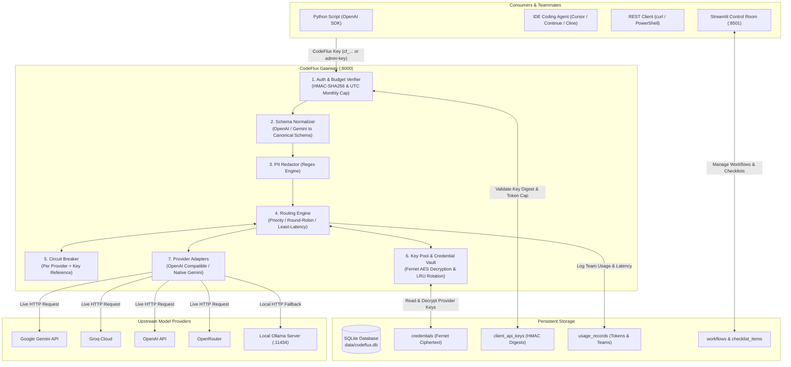
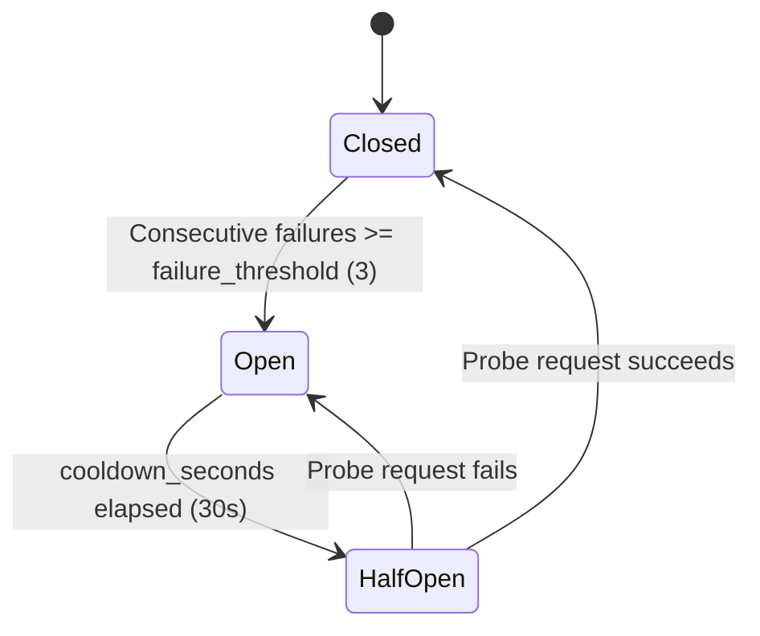
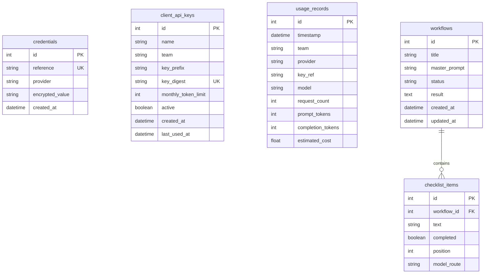
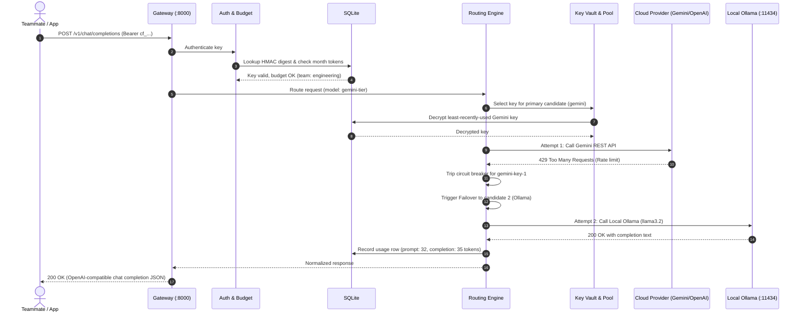

# CodeFlux: Complete Architecture & System Guide

CodeFlux is a high-performance, self-hosted AI gateway, credential vault, and team control room. It provides a single OpenAI-compatible interface that intelligently abstracts upstream LLM providers (Google Gemini, OpenAI, Groq, OpenRouter, and local Ollama), pools encrypted credentials, enforces per-team token budgets, guarantees zero-downtime failover, and provides real-time observability.

---

## Table of Contents

1. [Executive Summary & Purpose](#1-executive-summary--purpose)
2. [Complete Technology Stack](#2-complete-technology-stack)
3. [High-Level System Architecture](#3-high-level-system-architecture)
4. [Deep Dive: Core Subsystems & Components](#4-deep-dive-core-subsystems--components)
   - [4.1 FastAPI Gateway & ASGI Lifecycle (`codeflux/app.py`)](#41-fastapi-gateway--asgi-lifecycle-codefluxapppy)
   - [4.2 Authentication & Security (`codeflux/auth.py`, `codeflux/storage.py`)](#42-authentication--security-codefluxauthpy-codefluxstoragepy)
   - [4.3 Configuration & Route Rules (`codeflux/config.py`, `config/routes.yaml`)](#43-configuration--route-rules-codefluxconfigpy-configroutesyaml)
   - [4.4 Protocol Normalization Layer (`codeflux/normalization.py`)](#44-protocol-normalization-layer-codefluxnormalizationpy)
   - [4.5 Intelligent Routing Engine (`codeflux/router.py`)](#45-intelligent-routing-engine-codefluxrouterpy)
   - [4.6 Circuit Breaker & Automatic Failover (`codeflux/circuit.py`)](#46-circuit-breaker--automatic-failover-codefluxcircuitpy)
   - [4.7 Encrypted Credential Vault & LRU Key Pool (`codeflux/storage.py`, `codeflux/keys.py`)](#47-encrypted-credential-vault--lru-key-pool-codefluxstoragepy-codefluxkeyspy)
   - [4.8 Upstream Provider Adapters (`codeflux/adapters/`)](#48-upstream-provider-adapters-codefluxadapters)
   - [4.9 Privacy & PII Redaction (`codeflux/pii.py`)](#49-privacy--pii-redaction-codefluxpiipy)
   - [4.10 Persistence & SQLite Data Model (`codeflux/storage.py`)](#410-persistence--sqlite-data-model-codefluxstoragepy)
   - [4.11 Observability, Metrics & Structured Logging (`codeflux/metrics.py`)](#411-observability-metrics--structured-logging-codefluxmetricspy)
   - [4.12 Streamlit Control Room Dashboard (`streamlit_app.py`)](#412-streamlit-control-room-dashboard-streamlit_apppy)
   - [4.13 Autonomous IDE Task Handoff (`/v1/ide/workflows/...`)](#413-autonomous-ide-task-handoff-v1ideworkflows)
5. [Complete Request Lifecycle Walkthrough](#5-complete-request-lifecycle-walkthrough)
6. [Developer & Teammate Integration Guide](#6-developer--teammate-integration-guide)
7. [Operations, Troubleshooting & Failure Recovery](#7-operations-troubleshooting--failure-recovery)

---

## 1. Executive Summary & Purpose

### The Problems CodeFlux Solves

1. **API Key Sprawl & Leakage Risk**: Distributing production OpenAI or Gemini keys to every developer's laptop creates severe security liabilities. If a laptop is compromised or a developer commits `.env` to GitHub, company credentials leak.
2. **Provider Lock-In & Protocol Incompatibilities**: Gemini, OpenAI, Groq, and Ollama each use different request schemas, parameter names, and authentication headers.
3. **Outages & Rate Limits**: When an upstream vendor experiences downtime or strict 429 rate limits, user applications break unless resilient retry-and-failover logic is implemented in every client app.
4. **Runaway Costs & Missing Attribution**: Direct provider bills do not explain which internal team or project burned the tokens.
5. **Offline/Local Development**: When cloud credits expire or internet connections drop, local development stalls without a seamless fallback to local models.

### How CodeFlux Solves Them

- **Single Gateway Endpoint**: Applications point their OpenAI SDK or HTTP clients to `http://localhost:8000/v1`.
- **Credential Masking**: Teammates receive personal `cf_...` keys with token quotas. Upstream provider keys stay encrypted inside the centralized SQLite database.
- **Dynamic Failover**: If Gemini fails or hits a rate limit, CodeFlux automatically reroutes the request in-flight to Groq, OpenAI, or local Ollama without the client noticing.
- **Centralized Accounting**: Every prompt and completion token is logged against the responsible team in SQLite.
- **Self-Hosted & Zero Cloud Dependency**: Operates entirely on your local machine, server, or private network using SQLite and local Python processes.

---

## 2. Complete Technology Stack

| Layer | Technology | Version | Purpose in CodeFlux |
|---|---|---|---|
| **Language** | Python | `>= 3.10` | Core language runtime across gateway and dashboard |
| **API Gateway** | FastAPI | `>= 0.115` | High-throughput asynchronous ASGI web framework |
| **ASGI Server** | Uvicorn | `>= 0.30` | Production ASGI web server running the gateway |
| **Data Validation** | Pydantic v2 | `>= 2.8` | Strict schema validation, request parsing, and serializing |
| **Settings Management** | Pydantic-Settings | `>= 2.4` | Loading `.env` and environment variables with type coercion |
| **Asynchronous HTTP** | HTTPX | `>= 0.27` | Async HTTP client with connection pooling and streaming |
| **Database ORM** | SQLAlchemy | `>= 2.0` | Async ORM mappings, session management, and querying |
| **Database Driver** | AioSQLite | `>= 0.20` | Non-blocking async SQLite driver for local persistence |
| **Database Engine** | SQLite 3 | `3.x` | Zero-configuration single-file relational database (`data/codeflux.db`) |
| **Cryptography** | `cryptography.fernet` | `>= 43.0` | AES-128-CBC + HMAC-SHA256 authenticated symmetric encryption for credentials |
| **Key Hashing** | `hashlib` & `hmac` | Standard Library | Constant-time HMAC-SHA256 hashing for client API keys |
| **Control Room UI** | Streamlit | `>= 1.57` | Web dashboard for key pooling, budget tracking, and work planner |
| **Metrics Engine** | Prometheus Client | `>= 0.20` | Prometheus metric exporter (`/metrics`) for latency, tokens, circuits |
| **Structured Logging** | `python-json-logger` | `>= 2.0` | Machine-readable JSON logs for auditing and monitoring |
| **Local LLM Engine** | Ollama | `llama3.2` | Zero-cost local LLM fallback server (`:11434`) |
| **Containerization** | Docker / Compose | Multi-container | Orchestrating gateway, dashboard, and Ollama |
| **Test & Quality** | Pytest / Respx / Ruff | Latest | Unit testing, mock HTTP interceptors, linting |

---

## 3. High-Level System Architecture



---

## 4. Deep Dive: Core Subsystems & Components

### 4.1 FastAPI Gateway & ASGI Lifecycle (`codeflux/app.py`)

The gateway is built on FastAPI. Its lifecycle is managed asynchronously via an `@asynccontextmanager` lifespan:

```python
@asynccontextmanager
async def lifespan(app: FastAPI):
    # 1. Parse and validate config/routes.yaml
    config = load_config(settings.config_path)
    # 2. Initialize database connection pool and create tables if absent
    database = Database(settings.database_url)
    await database.initialize()
    # 3. Instantiate Fernet Credential Vault using CODEFLUX_MASTER_SECRET
    vault = CredentialVault(database.sessions, settings.master_secret)
    # 4. Instantiate shared async HTTP client with connection pooling
    client = httpx.AsyncClient(timeout=30)
    # 5. Wire router, circuit breaker, key pool, and repositories into app.state
    ...
    yield
    # 6. Graceful shutdown: close HTTP connection pool and database engine
    await client.aclose()
    await database.close()
```

By storing singleton instances on `app.state`, CodeFlux ensures zero resource leakage, eliminates per-request connection overhead, and maintains thread-safe in-memory circuit and latency counters.

---

### 4.2 Authentication & Security (`codeflux/auth.py`, `codeflux/storage.py`)

CodeFlux implements a **two-tier authentication model**:

#### 1. Static Bootstrap Keys
- Defined in `.env` via `CODEFLUX_GATEWAY_KEYS=demo-key:demo,admin-key:admin`.
- Format: `key_secret:team_name`.
- Verified using constant-time string comparison (`secrets.compare_digest`).
- Intended for administrator bootstrap, emergency recovery, or service accounts.

#### 2. Dynamic Managed Teammate Keys
- Generated via the Streamlit dashboard or API.
- Always formatted as `cf_<32-byte-token-urlsafe>` (e.g., `cf_jxR4ARHW...`).
- **One-way storage**: The raw key is displayed to the user **exactly once** upon creation. CodeFlux hashes the key using **HMAC-SHA256** keyed with `CODEFLUX_MASTER_SECRET`:
  $$\text{key\_digest} = \text{HMAC-SHA256}(\text{CODEFLUX\_MASTER\_SECRET}, \text{raw\_key})$$
- Only the `key_prefix` (first 11 characters) and the `key_digest` are saved to SQLite.

#### Monthly Token Budget Enforcement
When a managed key authenticates:
1. The gateway queries `usage_records` for total tokens consumed by that key's assigned team since the 1st of the current UTC calendar month.
2. If `tokens_used >= monthly_token_limit`, the request is terminated immediately with:
   ```json
   HTTP 429 Too Many Requests
   {"detail": "monthly CodeFlux token budget exhausted"}
   ```
3. The upstream LLM is never called, saving cloud costs.

---

### 4.3 Configuration & Route Rules (`codeflux/config.py`, `config/routes.yaml`)

Configuration is split between operational environment variables and routing topology:

#### Operational Settings (`.env`)
Loaded via Pydantic-Settings with prefix `CODEFLUX_`:
- `CODEFLUX_MASTER_SECRET`: Primary cryptographic secret for HMAC and Fernet encryption.
- `CODEFLUX_GATEWAY_KEYS`: Bootstrap client keys.
- `CODEFLUX_DASHBOARD_PASSWORD`: Dashboard login password.
- `CODEFLUX_DATABASE_URL`: SQLAlchemy connection URI (`sqlite+aiosqlite:///./data/codeflux.db`).
- `CODEFLUX_HOST` / `CODEFLUX_PORT`: Network bind address and port (default `0.0.0.0:8000`).

#### Routing Topology (`config/routes.yaml`)
Defines logical model aliases (`gpt-4-tier`, `gemini-tier`, `embeddings`). Clients request these aliases instead of vendor-specific model strings:

```yaml
circuit_breaker:
  failure_threshold: 3
  cooldown_seconds: 30

provider_base_urls:
  ollama: http://localhost:11434/v1

routes:
  gpt-4-tier:
    strategy: priority
    total_timeout_seconds: 180
    pii_redaction: false
    candidates:
      - provider: openai
        model: gpt-4o-mini
        api_key_ref: openai-primary
        timeout_seconds: 15
      - provider: groq
        model: llama-3.3-70b-versatile
        api_key_ref: groq-primary
        timeout_seconds: 15
      - provider: gemini
        model: gemini-3.1-flash-lite
        api_key_ref: gemini-primary
        timeout_seconds: 15
    ollama_fallback_model: llama3.2
    ollama_fallback_timeout_seconds: 120
```

---

### 4.4 Protocol Normalization Layer (`codeflux/normalization.py`)

Clients can send OpenAI Chat Completion payloads or native Gemini `generateContent` JSON. The normalization layer converts diverse input shapes into unified internal dataclasses:

- **`NormalizedRequest`**:
  - `model`: Logical route alias.
  - `messages`: List of `Message(role, content)`.
  - `temperature`, `top_p`, `max_tokens`.
  - `stream`: Boolean indicating SSE streaming mode.
  - `tools`: OpenAI-compatible function calling specifications.
- **`NormalizedResponse`**:
  - `content`: Generated text.
  - `prompt_tokens`, `completion_tokens`.
  - `finish_reason`: `stop`, `length`, `tool_calls`.
  - `tool_calls`: Extracted structured function calls.

When the selected provider responds, CodeFlux translates the `NormalizedResponse` back into the caller's expected format (e.g., OpenAI `chat.completion` envelope or Gemini `candidates[0].content.parts`).

---

### 4.5 Intelligent Routing Engine (`codeflux/router.py`)

When a request arrives for a route (e.g., `gemini-tier`), the engine orders the candidates based on the configured strategy:

1. **`priority`**: Evaluates candidates in strict sequential order from top to bottom as listed in YAML.
2. **`round-robin`**: Dynamically rotates which candidate is attempted first on each request, distributing traffic evenly across models while keeping remaining candidates for failover.
3. **`least-latency`**: Tracks exponential moving average latency for each candidate; prioritizes the fastest responding provider.
4. **`weighted-random`**: Samples candidates without replacement based on configured weights.

#### Deadline Management
The route specifies a `total_timeout_seconds` (e.g., 60s). Each candidate attempt has an individual `timeout_seconds` (e.g., 15s). The routing engine calculates:
$$\text{effective\_timeout} = \min(\text{candidate.timeout\_seconds}, \text{remaining\_route\_deadline})$$
If a provider hangs, it is aborted before the overall route deadline expires.

---

### 4.6 Circuit Breaker & Automatic Failover (`codeflux/circuit.py`)

To prevent recurring timeouts against broken or rate-limited providers, CodeFlux implements an in-memory Circuit Breaker with a 3-state finite state machine:



- **Per-Key Circuit Granularity**: The circuit key is `provider:key_reference` (e.g., `gemini:gemini-punya-f53253`). If one Gemini API key runs out of quota, only that key's circuit opens; other Gemini keys in the pool remain operational.
- **Failover Sequence**: If candidate 1 fails (timeout, 5xx server error, or circuit open), CodeFlux records a failover event, logs a structured warning, and immediately attempts candidate 2.
- **Local Ollama Rescue**: If all cloud candidates fail or have open circuits, CodeFlux falls back to the configured local Ollama model (`llama3.2`), ensuring the user's application receives a 200 OK.

---

### 4.7 Encrypted Credential Vault & LRU Key Pool (`codeflux/storage.py`, `codeflux/keys.py`)

#### Credential Encryption at Rest
Provider API keys are never stored in plaintext:
1. `CODEFLUX_MASTER_SECRET` is digested through SHA-256 to produce 32 bytes:
   $$\text{digest} = \text{SHA-256}(\text{CODEFLUX\_MASTER\_SECRET})$$
2. The digest is base64-encoded to form a 32-byte Fernet key.
3. Provider keys are encrypted using Fernet (AES-128 in CBC mode with an HMAC-SHA256 signature).
4. Only the ciphertext is stored in `data/codeflux.db`.

#### LRU Rotation & Rate Limit Awareness
Multiple teammates can contribute their own API keys for the same provider (e.g., 3 different Gemini keys).
- **Least-Recently-Used (LRU)**: When a route calls Gemini, `KeyPool` selects the active key that has not been used the longest.
- **Header Parsing**: Upstream response headers (`x-ratelimit-remaining-requests`, `x-ratelimit-reset-requests`) are inspected. If a key reports 0 requests remaining, the pool temporarily marks it ineligible until the reset timestamp passes.

---

### 4.8 Upstream Provider Adapters (`codeflux/adapters/`)

- **`ProviderAdapter` (Base)**: Abstract contract defining `chat()`, `stream()`, `embeddings()`, and `health_check()`.
- **`OpenAICompatibleAdapter`**: Interacts with OpenAI, Groq, OpenRouter, and Ollama. Translates function calling, temperature, penalties, and streaming SSE tokens.
- **`GeminiAdapter`**: Directly speaks Google's native REST API (`v1beta/models/...:generateContent`), mapping Gemini's `contents`, `parts`, and `generationConfig`.
- **`AdapterRegistry`**: Manages adapter singletons and maps provider names (`gemini`, `openai`, `groq`, `ollama`) to their custom base URLs.

---

### 4.9 Privacy & PII Redaction (`codeflux/pii.py`)

When `pii_redaction: true` is configured on a route:
- Prompts pass through `PIIRedactor` before leaving the local network.
- Regular expressions sanitize sensitive entity formats:
  - **Emails**: Replaced with `[EMAIL_REDACTED]`
  - **Credit Card Numbers**: Replaced with `[CARD_REDACTED]`
  - **US Social Security Numbers / National IDs**: Replaced with `[SSN_REDACTED]`
  - **Phone Numbers**: Replaced with `[PHONE_REDACTED]`
- Redaction is strictly one-way for outbound requests.

---

### 4.10 Persistence & SQLite Data Model (`codeflux/storage.py`)

Stored in `data/codeflux.db` via async SQLAlchemy:



---

### 4.11 Observability, Metrics & Structured Logging (`codeflux/metrics.py`)

#### Prometheus Endpoint (`GET /metrics`)
Exposes live counters and histograms for scraping:
- `codeflux_requests_total{route, provider, status}`: Total traffic volume.
- `codeflux_provider_latency_seconds{provider}`: Latency percentiles ($p50, p90, p99$).
- `codeflux_tokens_total{provider, token_kind, key_ref}`: Cumulative token consumption.
- `codeflux_failovers_total{provider, reason}`: Failover occurrences.
- `codeflux_circuit_open{provider_key}`: Boolean gauge indicating open circuits.

#### Structured JSON Logging
Every request produces a clean JSON log entry:
```json
{
  "asctime": "2026-10-05 20:50:45,532",
  "levelname": "INFO",
  "name": "codeflux.router",
  "message": "request_complete",
  "route": "gemini-tier",
  "provider": "ollama",
  "latency_ms": 13250.0,
  "attempts": ["gemini:no-key", "groq:no-key", "openai:no-key", "ollama"],
  "team": "admin"
}
```

---

### 4.12 Streamlit Control Room Dashboard (`streamlit_app.py`)

A graphical control room running on port `8501`:
1. **Overview Tab**: Real-time health gauges, last routed provider, total token counters, and team-by-team consumption charts.
2. **Work Planner Tab**: Converts high-level prompts into actionable checklists, assigns model routes per item, and executes workflows.
3. **Quota Pool Tab**: Interface for teammates to contribute Gemini, OpenAI, or Groq keys into the encrypted pool.
4. **Team Access Tab**: Administrator interface to view team usage and issue managed `cf_...` keys with custom monthly limits.

---

### 4.13 Autonomous IDE Task Handoff (`/v1/ide/workflows/...`)

CodeFlux includes built-in endpoints for AI coding agents (such as Cline, Cursor, or Antigravity):
1. **Fetch Next Task**: `GET /v1/ide/workflows/{id}/next-task` returns the current task, assigned model route, full project context, and completion URL.
2. **Execute**: The IDE agent completes the task locally using its file and shell tools.
3. **Report Complete**: `POST /v1/ide/workflows/{id}/tasks/{task_id}/complete` updates the checklist item and records the result.
4. Repeat until all checklist items are finished.

---

## 5. Complete Request Lifecycle Walkthrough



---

## 6. Developer & Teammate Integration Guide

### 6.1 Using Python with the Official OpenAI SDK

Install the OpenAI client:
```powershell
pip install openai
```

Point the client to CodeFlux:
```python
from openai import OpenAI

client = OpenAI(
    base_url="http://localhost:8000/v1",  # Local gateway address
    api_key="cf_your_personal_key",       # Your CodeFlux key (or admin-key)
)

response = client.chat.completions.create(
    model="gemini-tier",                  # Logical CodeFlux route
    messages=[
        {"role": "system", "content": "You are a helpful software engineer."},
        {"role": "user", "content": "Explain CodeFlux in one sentence."}
    ],
)
print(response.choices[0].message.content)
```

### 6.2 Using PowerShell or curl (REST API)

```powershell
$body = @{
    model = "gemini-tier"
    messages = @(
        @{ role = "user"; content = "Say hello from CodeFlux." }
    )
} | ConvertTo-Json -Depth 5

$params = @{
    Uri         = "http://localhost:8000/v1/chat/completions"
    Method      = "Post"
    Headers     = @{ Authorization = "Bearer admin-key" }
    ContentType = "application/json"
    Body        = $body
}

$response = Invoke-RestMethod @params
$response.choices[0].message.content
```

### 6.3 Configuring IDE Coding Assistants (Cursor, Continue, Aider, Cline)

In your tool settings:
- **Provider**: OpenAI Compatible
- **Base URL**: `http://localhost:8000/v1`
- **API Key**: `cf_your_personal_key`
- **Model Name**: `gemini-tier` or `gpt-4-tier`

### 6.4 Multi-Laptop Collaboration on Local Wi-Fi

1. **Host Laptop**:
   - Find Wi-Fi IP: `(Get-NetIPAddress -AddressFamily IPv4 -InterfaceAlias "Wi-Fi").IPAddress` (e.g., `192.168.1.50`).
   - Start services:
     ```powershell
     python -m codeflux
     streamlit run streamlit_app.py --server.address 0.0.0.0
     ```
   - Open `http://localhost:8501`, go to **Team access**, and create a personal key for your teammate.
2. **Teammate Laptop**:
   - Connect to the same Wi-Fi.
   - Point browser to `http://192.168.1.50:8501` to view the control room.
   - Configure Python scripts with `base_url="http://192.168.1.50:8000/v1"` and their personal `cf_...` key.
   - Both laptops share the exact same SQLite database, quota pool, and workflows in real time.

---

## 7. Operations, Troubleshooting & Failure Recovery

### 7.1 Critical Rule: Never Change `CODEFLUX_MASTER_SECRET` Once Initialized

`CODEFLUX_MASTER_SECRET` in `.env` is the root cryptographic seed for:
1. Deriving HMAC digests for managed client keys (`cf_...`).
2. Encrypting provider keys in the database.

> [!WARNING]
> If `CODEFLUX_MASTER_SECRET` is modified after keys have been created, **all existing `cf_...` client keys will fail to authenticate (HTTP 401)**, and **all stored provider credentials will become unreadable (`InvalidToken`)**. Always back up `.env` and `data/codeflux.db` together.

---

### 7.2 Troubleshooting Common Errors

| Error | Root Cause | Solution |
|---|---|---|
| **`401 Unauthorized: invalid or missing CodeFlux API key`** | The client passed an unknown key or a key mismatch occurred. | 1. Ensure the key exists in `CODEFLUX_GATEWAY_KEYS` (e.g. `admin-key`) or `client_api_keys`.<br>2. If `.env` was recently edited, **restart the gateway process** (`python -m codeflux`) so it reloads environment variables. |
| **`429 Too Many Requests: monthly CodeFlux token budget exhausted`** | The team has exceeded its configured monthly token limit. | In the Streamlit dashboard (**Team access**), issue a new key or increase the budget for that team. |
| **`503 Service Unavailable: all providers failed`** | Every candidate in the route failed, and Ollama is unreachable. | 1. Add valid provider keys under **Quota pool**.<br>2. Ensure Ollama is running locally (`ollama run llama3.2`). |
| **`The 'from' keyword is not supported...`** | Python code was pasted directly into the PowerShell terminal. | Run `python` first to open the interactive REPL, or save the code in a `.py` file and run `python script.py`. |
| **`ModuleNotFoundError: No module named 'openai'`** | The `openai` package is not installed in the virtual environment. | Run `pip install openai`. |

---

## 8. Summary

CodeFlux transforms fragile, fragmented LLM access into a resilient, enterprise-grade AI infrastructure for local teams. By decoupling the client application from upstream vendors, your applications gain automated failover, zero credential leakage, centralized cost controls, and uninterrupted local fallback.
